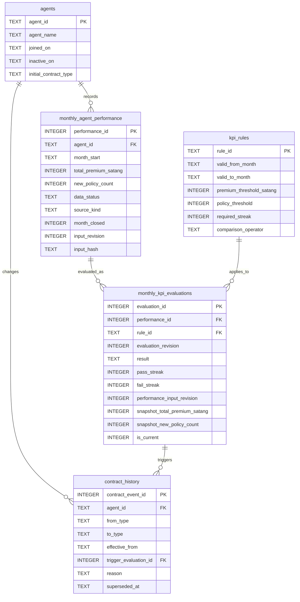

# Relational model — Test Case #1 KPI

ไฟล์นี้อธิบาย Data Modeling/KPI.

Important requirements:

- หนึ่งผลการขายต่อ `(agent_id, month_start)` และเก็บ revision/hash สำหรับ audit
- เงินใช้ integer satang เพื่อไม่ให้ floating-point ทำให้เกณฑ์ `> 15,000 บาท` ผิด
- ผลประเมินปัจจุบันมีได้หนึ่งแถวต่อ performance; revision เดิมยังอยู่
- Contract event เป็นประวัติแบบมี effective date และอ้าง evaluation ที่ทำให้เปลี่ยนสัญญา
- สัญญาใหม่มีผลวันแรกของเดือนถัดจากเดือนที่ streak ครบ 3 เดือน
- `PENDING`, เดือนที่ยังไม่ปิด และเดือนปฏิทินที่ขาดช่วงจะไม่ถูกนำไปต่อ streak
- ข้อมูลตัวอย่าง KPI เป็น synthetic
